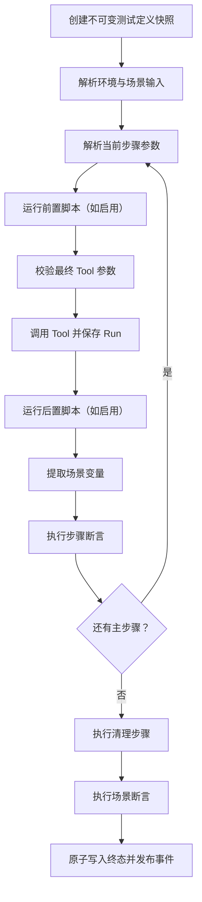

# MCP Inspector 1.5.0 自动化测试设计与开发规范

## 文档状态

| 项目 | 内容 |
|---|---|
| 状态 | Implemented，M1–M5 已完成并通过发布前门禁 |
| 目标版本 | `1.5.0` |
| 当前基线 | `1.0.4` |
| 更新日期 | 2026-09-01 |
| 适用范围 | Web UI、Hono API、SQLite、Tool/Workflow 执行、测试报告和导入导出 |
| 配套规范 | [前端 UI 与交互开发规范](./FRONTEND-DEVELOPMENT-STANDARDS.md) |
| 后续规划 | [MCP Inspector 2.0.0 升级规划](./UPGRADE-2.0.0.md) |

## 1. 版本目标

1.5.0 将 MCP Inspector 从“人工调试并保存一次 Tool 调用”升级为“可以配置、重复执行并自动判定结果的 MCP 测试工作台”。

主要用户是 MCP Server 开发者、接口测试人员和回归测试维护者。用户可以：

1. 把一个 Tool 的参数和期望保存为单 Tool 测试用例。
2. 将多个相互依赖的 Tool 调用编排为场景测试。
3. 把单 Tool 用例和场景用例组织成测试套件。
4. 执行用例或套件，查看每一步请求、响应、断言和完整 Run 轨迹。
5. 从历史 Run 或已保存请求创建用例，并显式更新基线。

成功标准不是“能连续点击多个 Tool”，而是每次测试都具有不可变执行快照、确定的断言结果、明确的连接身份和可复现的历史记录。

## 2. 已确认的产品决策

### 2.1 测试对象

- 单 Tool 调用使用 `kind: "tool"`。
- 多 Tool 串行依赖使用 `kind: "scenario"`。
- 测试套件可以包含两种用例，但套件成员之间不共享临时变量。
- 如果多个 Tool 之间需要传递响应值，它们必须属于同一个场景，而不是依赖套件执行顺序传值。

### 2.2 身份边界

- 每个 Tool 步骤必须绑定 `projectId + connectionId + toolName`。
- 连接、认证、环境变量和运行时始终按 `connectionId` 隔离，绝不按 URL、域名或 Server 名称复用。
- Server 名称只用于显示；重命名 Server 不改变测试目标。
- Tool 定义以执行开始时的快照 ID 和哈希记录，历史结果不随后续目录刷新而改变。

### 2.3 参数和变量

- 单 Tool 用例保存 canonical JSON object 参数。
- 场景步骤可以使用固定值、场景输入、环境变量、临时变量或前序步骤响应映射参数。
- 场景临时变量只存在于一次执行中，不写回项目或 Server 环境变量。
- 已有 Tool 前置/后置脚本仍可参与执行，但场景编排不隐藏在脚本内部。
- 前置脚本启用时，必填参数校验继续延后到脚本执行后。

### 2.4 断言和结果

- 声明式断言是默认能力；脚本只用于声明式规则无法表达的高级检查。
- `failed` 表示 Tool 已完成但断言不满足。
- `error` 表示连接、参数映射、脚本、持久化或执行基础设施失败。
- MCP `isError: true` 是可断言的业务结果，不自动归类为基础设施错误。
- 成功执行不得自动覆盖期望或基线；更新必须由用户显式确认。

### 2.5 副作用与重试

- 默认不自动重试 Tool 调用。
- `destructiveHint: true` 的 Tool 在交互执行前要求显式确认。
- 测试套件批量执行破坏性 Tool 时必须再次确认本次范围。
- 1.5.0 不承诺对 MCP Server 已产生的业务副作用进行回滚。

### 2.6 范围与删除语义

- Server 被测试定义引用时默认阻止删除，并要求先处理对应测试依赖。
- 1.5.0 不提供“删除 Server 并级联删除测试定义/历史”的快捷操作；若后续需要，必须单独确认交互与恢复边界。
- 1.5.0 继续排除 headless CLI/CI Runner；共享契约不携带 CLI 专用字段，为 1.6+ 保留 additive 扩展空间。

## 3. 非目标

1.5.0 不包含：

- 任意节点图、循环、递归场景或动态生成步骤。
- 跨套件成员共享运行时变量。
- 分布式 Worker、远程执行、云同步或团队权限。
- 通用浏览器自动化或非 MCP 接口测试。
- 修改 QuickJS 权限，不开放任意网络、Node.js、文件系统或进程能力。
- 默认把 OAuth access token、Bearer Token 或敏感环境变量写入测试定义、报告或导出。
- 无界面 CI Runner 和 JUnit 输出；该能力作为 1.6+ 的兼容扩展预留接口。
- 为自动化测试重写现有 Run、Workflow、Tab 或连接生命周期。

## 4. 能力地图

| Module id | 职责 | 依赖 |
|---|---|---|
| `test-definition` | 定义、版本化和持久化单 Tool/场景用例 | — |
| `assertion-engine` | 解析数据源并执行确定性声明式断言 | — |
| `test-execution` | 执行单 Tool 用例并保存快照、Run 和断言结果 | test-definition, assertion-engine |
| `scenario-execution` | 按步骤编排 Tool、映射参数、提取变量、轮询与清理 | test-execution |
| `test-suite` | 组织用例、控制顺序/并发/失败策略并汇总结果 | test-execution, scenario-execution |
| `test-reporting` | 展示、筛选、比较、导出测试执行历史 | test-execution, scenario-execution, test-suite |
| `test-ui` | 测试列表、编辑器、场景编排器、执行器和报告界面 | 以上全部模块 |

构建顺序：

```text
test-definition + assertion-engine
                ↓
          test-execution
                ↓
        scenario-execution
                ↓
            test-suite
                ↓
     test-reporting + test-ui
```

模块依赖必须保持单向。`test-suite` 只引用用例 ID，不复制用例实现；`scenario-execution` 只通过统一调用编排器执行 Tool，不直接访问 MCP Client runtime。

## 5. 领域模型

### 5.1 测试用例

```ts
type TestCaseDefinition = ToolTestCaseDefinition | ScenarioTestCaseDefinition;

interface TestCaseBase {
  id: string;
  projectId: string;
  kind: "tool" | "scenario";
  name: string;
  description: string;
  tags: string[];
  revision: number;
  isEnabled: boolean;
  createdAt: string;
  updatedAt: string;
}

interface ToolTestCaseDefinition extends TestCaseBase {
  kind: "tool";
  target: ToolTarget;
  arguments: Record<string, JsonValue>;
  assertions: AssertionDefinition[];
  timeoutMs: number;
}

interface ScenarioTestCaseDefinition extends TestCaseBase {
  kind: "scenario";
  inputs: ScenarioInputDefinition[];
  steps: ScenarioStepDefinition[];
  cleanupSteps: ScenarioStepDefinition[];
  assertions: AssertionDefinition[];
  failurePolicy: "STOP" | "CONTINUE";
}

interface ToolTarget {
  connectionId: string;
  toolName: string;
}
```

`toolName` 用于定位当前 Tool；执行历史额外保存不可变 `toolSnapshotId` 和 `toolSnapshotHash`。如果 Tool 已移除，定义仍可查看，但执行前返回 `TOOL_NOT_AVAILABLE`。

### 5.2 场景步骤

```ts
interface ScenarioStepDefinition {
  id: string;                    // 创建后不可变，不使用数组下标作身份
  name: string;
  target: ToolTarget;
  fixedArguments: Record<string, JsonValue>;
  mappings: ArgumentMapping[];
  extractors: ResponseExtractor[];
  assertions: AssertionDefinition[];
  condition: ScenarioCondition | null;
  polling: PollingPolicy | null;
  onFailure: "STOP" | "CONTINUE" | "SKIP_REMAINING";
}

interface ArgumentMapping {
  targetPath: string;
  source: ValueSource;
  isRequired: boolean;
}

type ValueSource =
  | { kind: "LITERAL"; value: JsonValue }
  | { kind: "SCENARIO_INPUT"; name: string }
  | { kind: "ENVIRONMENT"; scope: "PROJECT" | "SERVER"; name: string }
  | { kind: "VARIABLE"; name: string }
  | { kind: "STEP_RESPONSE"; stepId: string; path: string };

interface ResponseExtractor {
  name: string;
  source: "RESULT" | "ERROR" | "HTTP";
  path: string;
  isRequired: boolean;
}
```

步骤 ID 必须稳定；调整顺序只改变 `position`，不改变映射引用。删除仍被其他步骤引用的步骤时必须阻止保存，并列出受影响映射。

### 5.3 测试套件

```ts
interface TestSuiteDefinition {
  id: string;
  projectId: string;
  name: string;
  description: string;
  tags: string[];
  revision: number;
  members: Array<{
    id: string;
    testCaseId: string;
    position: number;
    isEnabled: boolean;
  }>;
  executionPolicy: {
    concurrency: number;          // 1–8，默认 1
    stopOnFailure: boolean;
  };
}
```

套件成员顺序只控制调度，不构成数据依赖。`concurrency > 1` 时成员完成顺序不保证与提交顺序一致，报告仍按 `position` 展示。

### 5.4 执行状态

```ts
type TestExecutionStatus =
  | "QUEUED"
  | "RUNNING"
  | "PASSED"
  | "FAILED"
  | "ERROR"
  | "CANCELLED"
  | "INTERRUPTED";

type ScenarioStepStatus =
  | "PENDING"
  | "RUNNING"
  | "PASSED"
  | "FAILED"
  | "ERROR"
  | "SKIPPED"
  | "CANCELLED";
```

状态只允许单向转换。服务重启时，尚未终态的测试执行统一转为 `INTERRUPTED`，不自动重放可能有副作用的 Tool。

## 6. 场景测试编排

### 6.1 场景结构

1. **场景输入**：执行前由用户填写或从环境配置解析。
2. **主步骤**：按稳定顺序执行的 Tool 调用。
3. **清理步骤**：主流程成功、失败或取消后按策略执行。
4. **场景断言**：检查最终变量、步骤状态和总耗时。

1.5.0 使用线性流水线，不提供任意连线画布。线性编排更容易阅读、版本化、导出、审查和重现。

### 6.2 参数解析顺序

每个步骤在调用前按以下顺序生成最终参数：

```text
Tool Schema 默认值
→ 步骤固定参数
→ 场景输入映射
→ 项目/Server 环境变量引用
→ 前序步骤响应映射
→ 场景临时变量
→ 当前 Tool 前置脚本
→ 当前 Tool JSON Schema 校验
→ MCP tools/call
```

后写入的来源覆盖先前来源。所有覆盖都写入步骤参数解析日志，包含目标路径和来源类型，但敏感值只显示 `[REDACTED]`。

如果必需映射没有值，步骤以 `INPUT_MAPPING_FAILED` 结束；不得静默写入 `null`、空字符串或猜测默认值。

### 6.3 响应提取

Tool 完成且后置脚本完成后执行提取器：

```json
{
  "name": "taskId",
  "source": "RESULT",
  "path": "$.structuredContent.task_id",
  "isRequired": true
}
```

提取值保存到本次执行的场景变量表。变量必须是 JSON value；不存在、非 JSON 或超出大小限制时返回稳定错误。后续步骤通过 `VARIABLE` 或 `STEP_RESPONSE` 引用，不允许使用步骤名称作为身份。

### 6.4 安全轮询

异步任务状态检查可以配置原生轮询：

```ts
interface PollingPolicy {
  intervalMs: number;       // 250–60_000
  maxAttempts: number;      // 1–100
  timeoutMs: number;        // 整个轮询上限
  until: AssertionDefinition[];
  failWhen: AssertionDefinition[];
}
```

- 每次轮询都是独立 Run，并关联到同一个步骤尝试。
- 默认只允许 `readOnlyHint: true` 或 `idempotentHint: true` 的 Tool 使用轮询。
- 注解只是安全提示；用户仍需确认业务语义。
- 取消场景时停止 timer、取消当前 Run，并忽略 late completion。
- 轮询不使用固定 sleep 证明时序；测试 fixture 使用可控 barrier。

### 6.5 失败与清理

- `STOP`：当前步骤失败后停止主流程并进入清理。
- `CONTINUE`：记录失败，继续下一步骤，场景最终至少为 `FAILED`。
- `SKIP_REMAINING`：跳过剩余主步骤并进入清理。
- 清理步骤默认串行、尽力执行；某个清理步骤失败不阻止后续清理。
- 清理错误作为独立结果保存，不覆盖主流程的原始失败码和错误详情。
- 已成功完成的外部副作用不会因后续失败而声明回滚。

## 7. 断言引擎

### 7.1 数据源

```ts
type AssertionSource = "RUN" | "MCP_RESULT" | "MCP_ERROR" | "HTTP" | "WORKFLOW" | "VARIABLE";

interface AssertionDefinition {
  id: string;
  source: AssertionSource;
  path: string;
  operator: AssertionOperator;
  expected?: JsonValue;
  options?: {
    isNegated?: boolean;
    arrayOrder?: "ORDERED" | "UNORDERED";
    objectMatch?: "SUBSET" | "EXACT";
    caseSensitive?: boolean;
  };
  message?: string;
}
```

### 7.2 操作符

1.5.0 必须支持：

| 分组 | 操作符 |
|---|---|
| 存在性 | `EXISTS`, `NOT_EXISTS`, `IS_NULL`, `NOT_NULL` |
| 相等 | `EQUALS`, `NOT_EQUALS`, `DEEP_EQUALS`, `SUBSET` |
| 文本 | `CONTAINS`, `STARTS_WITH`, `ENDS_WITH`, `MATCHES_REGEX` |
| 数值 | `GT`, `GTE`, `LT`, `LTE`, `BETWEEN` |
| 数组 | `LENGTH_EQUALS`, `LENGTH_GTE`, `ARRAY_CONTAINS` |
| 类型 | `TYPE_IS`, `MATCHES_SCHEMA` |
| 运行 | `STATUS_IS`, `IS_ERROR_IS`, `DURATION_LTE`, `NETWORK_DURATION_LTE` |

默认语义：

- 类型严格，不将 `"1"` 自动转成 `1`。
- object 默认 `SUBSET`，只有显式选择时才做完全相等。
- array 默认有序；可以显式改为无序。
- 正则表达式使用有界线性状态机子集，限制 pattern、input、状态数和重复次数；1.5.0 不执行带分组、alternation 或 backreference 的原生回溯表达式，避免 ReDoS。
- JSON Schema 使用现有 Ajv 方言选择和缓存机制。
- 路径使用现有确定性 JSONPath 子集，不在 1.5.0 引入完整表达式执行器。

### 7.3 断言结果

每条断言保存：

- assertion ID 和定义快照。
- resolved path、actual 摘要、expected 摘要。
- `PASSED`、`FAILED` 或 `ERROR`。
- 稳定错误码、用户说明和耗时。
- 是否因脱敏而隐藏 actual/expected。

断言失败不会修改原 Run 的成功/失败状态。Run 表示调用事实，Test Execution 表示验证结论。

## 8. 执行架构

### 8.1 统一调用编排器

自动化测试不得复制已有 Run/Workflow 状态机。实现前先提取内部的 `ToolInvocationOrchestrator`：

```ts
type InvocationSource =
  | { kind: "DEBUG_TAB"; tabId: string }
  | { kind: "TEST_CASE"; testCaseId: string; testExecutionId: string; stepId?: string };

interface ToolInvocationRequest {
  projectId: string;
  target: ToolTarget;
  source: InvocationSource;
  idempotencyKey: string;
  arguments: Record<string, JsonValue>;
  executeWorkflow: boolean;
  allowDestructiveHelpers: boolean;
}
```

要求：

- 现有 `RunService.start()` 和调试 UI API 行为保持不变。
- 测试执行允许 `tabId = null`，不能为了执行测试创建隐藏 Tab。
- Tool 存在启用脚本时走已有 Workflow；未启用脚本时走普通 Run。
- 主 Run、辅助 Run、脚本日志、HTTP、RPC 和时间线继续使用现有权威记录。
- 自动化层只保存引用和验证结果，不复制完整协议轨迹。

### 8.2 执行流程



### 8.3 并发、取消和幂等

- 同一个测试定义允许同时执行多次，每次有独立 execution ID 和变量空间。
- 单次执行的步骤严格按顺序；套件成员并发受 `concurrency` 限制。
- 启动执行必须接受 `Idempotency-Key`，由调用方为一次意图生成并在重试时复用。
- 数据库使用唯一约束原子占用 key；不得先查再插入。
- 相同 key、相同 request hash 返回已有执行；相同 key、不同 request hash 返回 `422 IDEMPOTENCY_CONFLICT`。
- 在途重复返回 `202` 和权威 execution 资源地址。
- 取消关闭 observation fence、停止调度新步骤并取消当前 Run；late events 不得写入终态执行。
- 进程退出必须清除 timer、subscription、AbortController 和并发槽位。

## 9. SQLite 数据设计

新增发布 migration `012_automated_testing.sql`，不得修改 001–011。

### 9.1 表

| 表 | 作用 |
|---|---|
| `test_cases` | 用例元数据、kind、当前 revision 和 definition JSON |
| `test_case_targets` | 从定义投影出的 connection/tool 依赖索引，用于身份外键与 Server 删除保护 |
| `test_case_revisions` | 每次保存的不可变定义版本 |
| `test_suites` | 套件元数据、revision 和执行策略 |
| `test_suite_members` | 套件成员、稳定成员 ID 和 position |
| `test_executions` | 单 Tool/场景执行快照、状态、时间和最终错误 |
| `test_execution_steps` | 场景步骤/轮询尝试、Run/Workflow 引用和状态 |
| `test_assertion_results` | 每条断言的快照、actual/expected 摘要和结论 |
| `test_execution_variables` | 场景临时变量的脱敏审计记录 |
| `test_suite_executions` | 套件执行快照、聚合状态和统计 |
| `test_suite_execution_items` | 套件成员到测试执行的关联 |

### 9.2 约束

- 所有表均包含 `project_id`，所有跨表引用必须验证同一 project。
- Tool 目标引用 `connection_id`，不存 URL 作为身份。
- 删除 Server 时若存在测试定义，默认阻止删除并提示依赖数量；1.5.0 必须先处理依赖，不提供级联删除测试历史。
- 删除测试定义不删除历史执行；执行保存完整定义快照。
- JSON 列写入前使用共享 schema 验证，读取失败返回稳定存储损坏错误，不把异常 JSON 传给 UI。
- migration 1→12、重复打开、外键、事务回滚和 source/dist byte-match 必须自动化验证。

### 9.3 数据大小边界

- 用例名称 1–120 字符，描述最大 2,000 字符，标签最多 20 个。
- 单用例定义最大 2 MiB。
- 单场景主步骤最多 100，清理步骤最多 20。
- 单步骤映射、提取器、断言各最多 100。
- 大响应继续由 Run 的现有截断/摘要策略处理；测试表不重复保存完整响应。

## 10. API 设计

所有 API 继续使用现有 Inspector session、Origin 校验、统一 error envelope、严格请求 schema 和防御性客户端解码。

### 10.1 测试用例

```text
GET    /api/projects/:projectId/test-cases
POST   /api/projects/:projectId/test-cases
GET    /api/projects/:projectId/test-cases/:testCaseId
PATCH  /api/projects/:projectId/test-cases/:testCaseId
DELETE /api/projects/:projectId/test-cases/:testCaseId
POST   /api/projects/:projectId/test-cases/:testCaseId/executions
```

列表参数：`kind`、`connectionId`、`tag`、`query`、`cursor`、`limit`。列表固定按 `updatedAt DESC, id DESC`，cursor 必须绑定筛选条件。

更新使用 `revision` 前置条件；过期 revision 返回 `409 TEST_CASE_REVISION_CONFLICT`，不进行字段级静默合并。

### 10.2 测试套件

```text
GET    /api/projects/:projectId/test-suites
POST   /api/projects/:projectId/test-suites
GET    /api/projects/:projectId/test-suites/:suiteId
PATCH  /api/projects/:projectId/test-suites/:suiteId
DELETE /api/projects/:projectId/test-suites/:suiteId
POST   /api/projects/:projectId/test-suites/:suiteId/executions
```

### 10.3 执行与事件

```text
GET  /api/projects/:projectId/test-executions
GET  /api/projects/:projectId/test-executions/:executionId
POST /api/projects/:projectId/test-executions/:executionId/cancel
GET  /api/projects/:projectId/test-executions/:executionId/events

GET  /api/projects/:projectId/test-suite-executions
GET  /api/projects/:projectId/test-suite-executions/:executionId
POST /api/projects/:projectId/test-suite-executions/:executionId/cancel
GET  /api/projects/:projectId/test-suite-executions/:executionId/events
```

事件流沿用现有有限 backlog、递增 sequence、live 去重、heartbeat、abort cleanup 和慢消费者断连策略。终态以 SQLite 详情为权威，SSE 只用于增量体验。

### 10.4 创建用例入口

```text
POST /api/projects/:projectId/test-cases/from-run
POST /api/projects/:projectId/test-cases/from-saved-item
```

转换只复制非敏感参数、可安全表达的响应基线和 connection/tool 身份。发现 secret、截断结果或已移除 Tool 时返回预览警告，用户确认后才创建。

### 10.5 稳定错误码

| Error code | 含义 |
|---|---|
| `TEST_CASE_INVALID` | 用例定义不合法 |
| `TEST_CASE_NOT_FOUND` | 用例不存在或不属于项目 |
| `TEST_CASE_REVISION_CONFLICT` | 保存时 revision 已过期 |
| `TEST_TARGET_NOT_AVAILABLE` | Server 或 Tool 当前不可执行 |
| `INPUT_MAPPING_FAILED` | 参数映射缺少值或类型不匹配 |
| `ASSERTION_INVALID` | 断言定义不可执行 |
| `ASSERTION_EVALUATION_ERROR` | 断言数据源/路径/Schema 处理失败 |
| `DESTRUCTIVE_CONFIRMATION_REQUIRED` | 需要确认破坏性 Tool |
| `TEST_EXECUTION_CONFLICT` | 幂等 key 与请求体冲突 |
| `TEST_EXECUTION_NOT_FOUND` | 执行不存在或不属于项目 |
| `TEST_EXECUTION_FAILED` | 未归类的受控执行错误 |

UI 不直接显示底层英文异常；错误区展示中文说明、稳定 error code 和下一步操作。

## 11. UI 与交互设计

### 11.1 信息架构

侧边栏新增一级模块“自动化测试”，内部使用视图页签：

1. 测试用例
2. 测试套件
3. 执行历史

Tools 页现有“已保存”继续保留。提供“转换为测试用例”，不在 1.5.0 自动迁移或删除现有 saved items。

### 11.2 测试用例列表

- 使用紧凑 Table/List，不使用每条一张卡片。
- 列：名称、类型、目标/步骤数、标签、最近结果、更新时间、操作。
- 支持按名称优先、描述次之的模糊搜索，以及类型、Server、标签和状态筛选。
- 操作：编辑、复制、执行、加入套件、导出、删除。
- 删除必须显示名称、历史保留策略和受影响套件。

### 11.3 单 Tool 用例编辑器

从上到下分为：

1. 基本信息：名称、描述、标签。
2. Tool 目标：Server 和 Tool；保存真实 connection ID。
3. 请求参数：复用现有 Form/Raw canonical 编辑器。
4. 期望与断言：一行一条，支持拖拽和键盘排序。
5. 执行设置：超时、脚本使用方式、破坏性确认策略。

选择 Tool 后加载定义快照。Tool 定义发生变化时显示 changed 状态和参数/Schema 差异，不自动改写已保存参数或断言。

### 11.4 场景编排器

桌面布局采用三栏：

```text
步骤列表            当前步骤编辑                       场景数据
──────────          ──────────────────────             ──────────
场景输入            Server / Tool                      输入预览
1 创建订单          固定参数 / 参数映射                临时变量
2 查询状态          响应提取 / 断言 / 轮询             引用检查
3 支付订单          失败策略                           定义问题
清理步骤
```

- 左栏只承担步骤导航和排序。
- 中栏是唯一主要滚动区，使用 Form/Disclosure，不嵌套大卡片。
- 右栏显示变量来源、使用位置和当前解析预览，不显示敏感值。
- 添加步骤后自动选择；切换步骤必须先保存/flush 当前草稿，失败则保留原步骤。
- 映射选择器只展示当前步骤之前可用的步骤和变量，避免创建前向引用。
- 拖拽必须提供“上移/下移”键盘替代。

### 11.5 测试套件编辑器

- 左侧候选用例，右侧套件成员；可搜索和筛选。
- 成员显示 Tool/场景类型、目标 Server、破坏性提示和最近结果。
- 可设置串行或 2–8 有限并发、失败后停止或继续。
- 套件开始前集中显示需要连接、缺失环境变量、已移除 Tool 和破坏性步骤。

### 11.6 执行结果

结果页固定状态栏和横向页签：

1. 概览
2. 步骤
3. 断言
4. 请求与结果
5. 调用详情
6. HTTP
7. RPC
8. 时间线
9. 脚本流水线（仅启用脚本时）

单 Tool 用例可以省略“步骤”。每个步骤点击后复用现有 Run 结果查看器。断言页默认只展开失败项，支持复制实际值、复制 JSONPath 和放大查看。

### 11.7 UI 状态

每个列表和编辑器必须覆盖：

- `initial`：尚未加载。
- `loading`：超过 300ms 显示进度。
- `empty`：解释如何从 Run、已保存请求或新建开始。
- `ready`：展示权威数据。
- `error`：保留草稿并提供重试。
- `stale`：Tool 定义、用例 revision 或环境发生变化。

切换 project、connection、test case、suite 或 execution 时使用完整身份 fence；旧请求不得写入新上下文。

### 11.8 可访问性

- Tabs、Disclosure、Dialog、Menu 和 Split Pane 遵循现有规范。
- 步骤列表使用稳定 ID，当前项通过 `aria-current` 或选中语义表达。
- 状态不只使用颜色；屏幕阅读器播报执行开始、终态和断言失败数量。
- SSE 高频事件不逐条进入 `aria-live`，只播报聚合进度。
- 所有纯图标按钮使用 Phosphor icon、`aria-label` 和 Tooltip。

## 12. 安全、敏感信息与导入导出

### 12.1 Secret

- 测试定义只保存环境变量引用，不复制解析后的 secret。
- 请求、响应、断言 actual/expected、日志和导出使用所属 connection 的脱敏配置。
- 即使 Server 关闭界面脱敏，默认测试导出仍不包含 OAuth token、Bearer Token 或敏感环境变量值。
- 不允许把 secret 写入 URL、Toast、普通日志、浏览器 storage 或稳定错误 message。
- 场景变量若来源包含 secret，变量本身继承 secret 标记并在所有展示中脱敏。

### 12.2 导出格式

1.5.0 使用独立版本 envelope：

```json
{
  "format": "mcp-inspector-automated-tests",
  "version": 1,
  "exportedAt": "2026-08-28T00:00:00.000Z",
  "data": {
    "testCases": [],
    "testSuites": []
  }
}
```

- 默认只导出定义，不导出执行历史。
- connection 使用导出内稳定别名映射；导入时显示 Server 绑定预览，不能按 URL 自动猜测。
- 导入先完整校验再单事务写入；任何失败不得留下半写入数据。
- 未知 envelope version 拒绝导入。
- 导入 ID 冲突时由用户选择跳过、复制为新对象或覆盖新 revision；不静默覆盖。

## 13. 项目结构

建议新增：

```text
src/shared/testing/
├── assertions.ts
├── test-case.ts
├── test-execution.ts
├── test-suite.ts
└── test-events.ts

src/server/testing/
├── assertion-engine.ts
├── test-case-repository.ts
├── test-case-service.ts
├── test-execution-repository.ts
├── test-execution-service.ts
├── scenario-runner.ts
├── suite-service.ts
└── routes.ts

src/client/features/testing/
├── TestNavigation.tsx
├── TestCaseList.tsx
├── ToolTestEditor.tsx
├── ScenarioEditor.tsx
├── SuiteEditor.tsx
├── TestExecutionView.tsx
└── __tests__/

src/server/projects/migrations/
└── 012_automated_testing.sql
```

共享 wire schema 必须位于 `src/shared/testing`，Server 和 Client 复用。Repository 只负责 SQL 映射，Service 负责领域约束，Route 负责 HTTP 边界，React feature 不直接解释数据库或 MCP payload。

## 14. 代码约定

使用 discriminated union、穷尽分支和明确输入/输出类型：

```ts
export function evaluateAssertion(
  definition: AssertionDefinition,
  context: AssertionContext,
): AssertionResult {
  const actual = resolveAssertionValue(definition, context);

  switch (definition.operator) {
    case "EXISTS":
      return actual === undefined ? failed(definition, actual) : passed(definition, actual);
    case "EQUALS":
      return Object.is(actual, definition.expected)
        ? passed(definition, actual)
        : failed(definition, actual);
    default:
      return assertNever(definition.operator);
  }
}
```

规则：

- 禁止 `any`；边界使用 `unknown` 并由共享 schema 解码。
- ID 使用领域别名或 branded type，禁止误传 connection/test/execution ID。
- 领域 enum wire value 使用 `UPPER_SNAKE_CASE`。
- 列表接口必须分页；cursor 绑定排序和筛选。
- 领域服务不返回 Hono Response，不依赖 React 类型。
- 错误使用稳定 code；原始异常只进入受控诊断链，且必须脱敏。

## 15. 测试策略

实现必须使用 RED → GREEN → REFACTOR；每个行为变化先加入失败测试。

### 15.1 纯单元测试

- JSONPath 子集、映射覆盖顺序和缺失值。
- 所有断言操作符、严格类型、subset/exact、ordered/unordered。
- 正则和 JSON Schema 资源边界。
- 场景状态机、失败策略、清理结果合并。
- secret 传播和脱敏。
- request hash、idempotency 冲突和 cursor 编解码。

### 15.2 SQLite 与 Service 测试

- migration 1→12、重复打开、所有 project/connection FK。
- revision CAS、删除依赖、历史保留。
- 两个独立 SQLite handle 并发占用同一 idempotency key。
- 定义快照、Tool 快照、Run/Workflow 关联和原子终态。
- 重启把活动执行标记为 interrupted。
- 取消、late completion、event persist failure 和事务回滚。

### 15.3 MCP 集成测试

- 真实 127.0.0.1 Streamable HTTP fixture。
- 同 URL、不同 connection 的 OAuth/Bearer/Header 不串认证。
- 普通 Tool、`isError: true`、超时、断连、截断响应。
- before → main → after 及 helper Run 关联。
- 场景步骤响应提取、下一步参数映射和安全轮询。
- 套件有限并发，使用 barrier 证明并发上限和顺序，不使用 timing-only sleep。

### 15.4 React 测试

- 用例/场景/套件编辑草稿和 revision 冲突。
- 映射只允许引用前序步骤。
- 切换 project/connection/case 时 abort 和 identity fence。
- 执行、取消、重试、SSE reconnect 和 terminal refetch。
- 破坏性确认、基线显式更新和保存失败保留页面。
- 键盘排序、Tabs、Disclosure、Dialog、Menu 和焦点恢复。
- 浅色/深色 token、无双重滚动和 sticky header。

### 15.5 Production E2E

至少覆盖：

1. 生产 build 启动 Inspector 和两个同 URL、不同认证的 MCP Server。
2. 从历史 Run 创建单 Tool 用例并通过断言。
3. 创建三步骤场景：创建 → 查询轮询 → 清理。
4. 响应字段映射到下一步骤，场景变量不污染项目/Server 环境。
5. 把单 Tool 和场景加入套件，以并发 2 执行并得到确定汇总。
6. 刷新后恢复定义和报告，但不恢复为活动执行。
7. 导出、导入到新项目并显式重新绑定 connection。
8. fixture 证明无 secret 出现在 URL、页面文本、日志或导出。

## 16. 开发命令与质量门槛

```bash
# 开发
npm run dev

# 聚焦测试
npx vitest run <affected-test-files>

# 类型检查
npm run typecheck

# 全部单元和集成测试
npm run test

# 生产构建
npm run build

# 生产浏览器验收
npm run test:e2e

# 完整交付门槛
npm run verify

# npm 发布内容检查
npm pack --dry-run --json
```

自动化测试涉及持久化、连接身份、Run、Workflow、路由和核心工作区，因此每个里程碑合并前必须运行 `npm run verify`。migration source 与构建副本必须 byte-match，测试进程正常退出且无 open handle。

## 17. 实施里程碑

### M1：定义与断言

- 共享 schemas、migration 012、测试用例 CRUD。
- 断言引擎和从 Run/已保存项创建预览。
- 单 Tool 用例编辑器，不执行真实 Tool。

验收：定义可安全保存、导出和恢复；断言纯函数测试完备；不改变现有 Run/Workflow 行为。

实施状态（2026-09-01）：已完成。已交付 migration 012、共享契约、定义 CRUD、26 种声明式断言、单 Tool 用例编辑器，以及从 Run/已保存项创建用例的服务端安全预览。创建和编辑阶段不执行真实 Tool；完整验证为 Vitest `671/671`、Playwright `3/3`。

### M2：单 Tool 执行

- 统一内部 invocation seam。
- 测试执行、Run/Workflow 关联、幂等、取消和事件。
- 单 Tool 执行结果和断言 UI。

验收：普通 Run 与 Workflow 回归全部通过；同 URL 不同连接不串认证；执行历史可重现。

实施状态（2026-09-01）：已完成。单 Tool 测试通过现有 Run/Workflow invocation seam 执行，不创建隐藏 Tab；持久化定义快照、最终参数、Run/Workflow 关联及断言结果。幂等、取消、terminal CAS、重启恢复和 late completion 均有回归测试；同 URL 不同连接使用各自 connection ID 对应的认证 session。前端支持执行、取消、破坏性确认和逐条断言结果。完整验证为 Vitest `685/685`、Playwright `3/3`。

### M3：场景测试

- 场景输入、步骤、映射、提取、变量、条件和清理。
- 安全轮询、失败策略和三栏编排器。
- 场景执行报告。

验收：多 Tool 值传递、失败、取消和清理均有确定结果；临时变量不持久化为环境变量。

实施状态（2026-09-01）：已完成。场景通过现有 Run/Workflow invocation seam 串行执行，支持输入和多来源参数映射、响应提取、执行内临时变量、条件、确定性轮询、失败策略与始终运行的清理步骤。每次步骤尝试都保留独立 Run/Workflow 引用并原子写入终态报告；临时变量不会写回 project/server 环境。前端支持输入、执行、取消与逐步骤/逐尝试报告。完整验证为 Vitest `700/700`、Playwright `3/3`。

### M4：测试套件

- 套件 CRUD、顺序、有限并发和聚合取消。
- 启动前检查和破坏性范围确认。
- 套件执行报告。

验收：并发上限由 barrier 测试证明；成员间无变量、认证和结果串扰。

实施状态（2026-09-01）：已完成。测试套件支持单 Tool/场景成员、稳定成员 ID、1–8 有限并发、失败后停止调度、聚合取消和按 position 的确定性报告；场景输入通过成员 ID 隔离。启动前会完整检查成员目标，并在任何调用开始前集中确认破坏性范围。migration 013 以软删除保留已有套件执行对成员的历史引用，报告始终从执行快照恢复身份。完整验证为 Vitest `715/715`、既有 Playwright `3/3`，新增套件生产 E2E `1/1`。

### M5：分享与发布

- 定义导入导出、绑定预览和冲突处理。
- 全量 E2E、迁移、打包、安全和可访问性门槛。
- README、Changelog、升级说明和 1.5.0 发布记录。

验收：1.0.4 数据原地升级且不丢失，包内容 allowlist、完整 verify 和独立审查通过。

实施状态（2026-09-01）：已完成。测试报告支持按项目分页查看执行历史，并追溯到不可变定义快照、断言结果、Run/Workflow、connection ID 与 Tool 快照。基线只允许对可用、未脱敏的等值断言实际值执行显式确认更新，并创建新 revision。版本化 JSON 包默认只导出当前测试/套件定义和 Server 引用别名，不包含凭证、解析后的 secret、执行历史或报告；导入要求逐个显式绑定当前项目 Server，完整校验后在单个 SQLite 事务内按复制、跳过或覆盖策略写入。完整验证为 Vitest `731/731`、Playwright `4/4`，migration 001–013 source/dist 字节一致，`npm pack --dry-run --json` 与独立安全质量复审通过。

## 18. 兼容与迁移

- 001–011 migration 保持原字节不变。
- 1.0.4 已有 Server、Tool、Folder、Tab、Run、Saved Item、Workflow 和环境变量不迁移或改写。
- `saved_tool_items` 继续可用；只提供显式“转换为测试用例”。
- 现有 Run API、Workflow API、结果 UI 和历史恢复保持兼容。
- 新路由和新共享类型全部是 additive。
- 1.5.0 数据库升级后，旧版本程序不保证可读取；发布前必须提供备份或导出提示。
- 回滚使用数据库备份/导出恢复，不编写破坏性 down migration。

## 19. 边界

### Always do

- 先更新本规范，再改变自动化测试契约。
- 使用 connection ID、测试 ID、execution ID 和 step ID 做身份 fence。
- 每个调用继续产生现有可检查 Run/Workflow 轨迹。
- 在 API、导入、SQLite JSON 和 MCP 响应边界执行共享 schema 校验。
- secret 默认脱敏，测试定义优先保存变量引用。
- 所有状态转换、取消、重启恢复和幂等行为使用自动化测试证明。

### Ask first

- 删除或自动迁移 existing saved items。
- 改变 Server 删除时测试定义的处理方式。
- 允许破坏性 Tool 自动确认或自动重试。
- 引入完整 JSONPath/表达式语言、可视化图编排或并行场景步骤。
- 将 headless CLI/CI Runner 纳入 1.5.0。
- 允许测试脚本获得新的宿主权限。
- 更改 secret 导出、OAuth token 持久化或脱敏默认值。

### Never do

- 按 URL 或域名复用连接认证。
- 通过创建隐藏 Tab 执行测试。
- 用步骤名称、数组下标或 UI position 作为持久化身份。
- 自动覆盖基线、猜测缺失映射或隐式类型转换。
- 将套件顺序当作成员间数据通道。
- 将 Run 成功/失败与断言通过/失败混为同一状态。
- 重写已发布 migration，或在导入失败后留下半写入数据。

## 20. 1.5.0 发布验收

只有同时满足以下条件才可发布：

1. 单 Tool 用例可以配置参数、断言、环境引用并重复执行。
2. 场景可以串行编排多个 Tool，映射前序响应、提取变量、轮询并执行清理。
3. 套件可以包含单 Tool 和场景用例，支持串行和有限并发。
4. 每次执行保存定义、环境引用、Tool、脚本和连接身份快照。
5. 每个实际 Tool 调用都可跳转到完整 Run/Workflow 轨迹。
6. `PASSED`、`FAILED`、`ERROR`、`CANCELLED`、`INTERRUPTED` 语义稳定且不混淆。
7. 同 URL 的不同 connection 在单用例、场景和套件并发中都不串认证。
8. 取消、重启、断连、断言异常、持久化失败和慢消费者均有确定终态且无资源泄漏。
9. 导入先校验后原子写入，导出默认不包含 secret 或解析后的凭证。
10. 浅色/深色、键盘主流程、身份 fence 和核心错误状态均有自动化覆盖。
11. `npm run verify`、migration byte-match、`npm pack --dry-run --json` 和进程退出检查通过。
12. 1.0.4 已有数据与行为不因启用自动化测试而改变。

## 21. 与 2.0.0 的关系

1.5.0 提前交付自动化测试的领域模型和核心业务闭环。2.0.0 不再首次创建这些能力，而是在兼容 1.5.0 数据/API 的前提下：

- 将测试页面迁移到统一 UI Foundation。
- 增强大型列表、JSON Viewer、运行比较和环境配置集。
- 为后续 headless CLI/CI、JUnit/JSON 报告和更高级场景编排保留扩展点。

如果 2.0.0 规划与本规范在自动化测试范围上冲突，以本 1.5.0 文档描述的已确认产品契约为准；实施 1.5.0 前应同步修订 2.0.0 中“首次交付测试用例/套件”的表述。

## 22. 待确认项

进入实施计划前只剩两个产品决策需要确认：

1. 删除 Server 时，默认应当“阻止删除并要求先处理测试定义”，还是“允许删除并把测试标记为目标缺失”？本规范暂按前者设计。
2. 1.5.0 是否需要无界面 CLI/CI Runner？本规范暂不包含，但 API、idempotency 和报告模型为后续扩展保留兼容空间。
