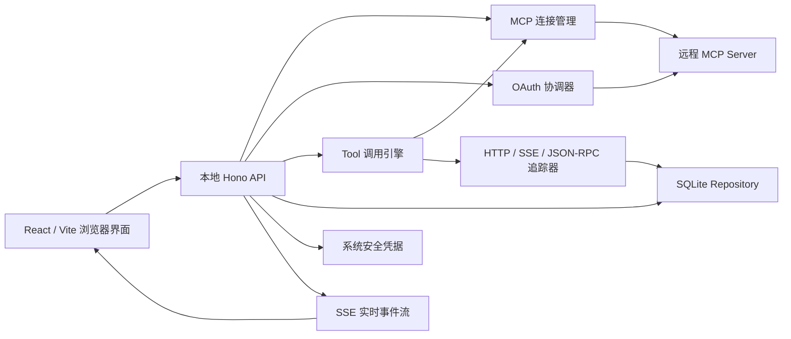
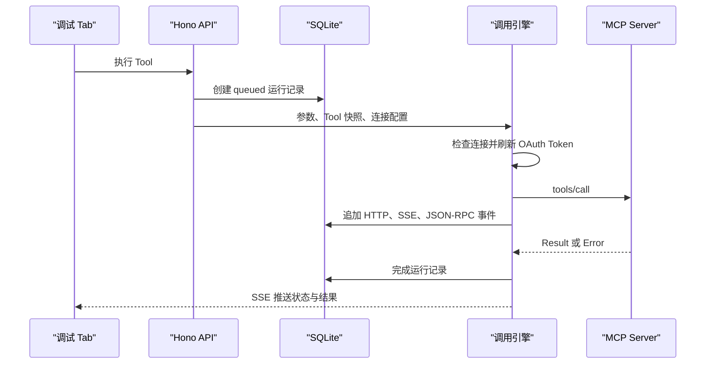

# DSers MCP Tool 调试平台设计

- 日期：2026-08-17
- 状态：对话设计已确认，等待书面规格最终审阅
- 工作名称：DSers MCP Inspector

## 1. 摘要

本项目是一款运行在测试人员电脑上的 MCP Tool 调试平台。产品要求 Node.js 22 或更高版本，通过一个命令启动本地服务，并在浏览器中提供类似 Apifox 的调试工作台。首版专注远程 MCP Server 的 Tools 能力，支持 Streamable HTTP、旧版 SSE、OAuth、Schema 表单、Raw JSON、多调试 Tab、自动调用历史、测试用例、单次调用回放、完整协议追踪以及 SQLite 数据导入导出。

React/Vite 负责浏览器界面，Hono 负责本地 API、MCP 会话、OAuth、SQLite 和追踪。服务仅监听 `127.0.0.1`。业务数据保存在本机 SQLite 中，不使用项目文件夹或 Git 管理；团队通过 `.mcpdbg` 包导入导出数据。OAuth Token、Refresh Token、Client Secret 和敏感 Header 保存在 macOS Keychain 或 Windows Credential Manager 中，不进入 SQLite 分享数据。

## 2. 目标

首版必须做到：

1. 保存并管理多个远程 MCP Server 连接。
2. 支持 Streamable HTTP，并兼容旧版 SSE。
3. 支持无认证、Bearer Token 和可观察的 OAuth 授权。
4. 通过 `tools/list` 展示 Tool、描述、Input Schema、Output Schema、Annotations 和原始定义。
5. 同一个 Tool 可以同时打开多个独立调试 Tab。
6. 使用 Schema 表单或完整 `arguments` Raw JSON 编辑调用参数，两种输入双向同步。
7. 格式化展示 MCP 调用结果，并支持查看 Raw JSON、文本、图片和其他内容块。
8. 保存每次调用的请求、结果、错误、耗时、HTTP、SSE、JSON-RPC 和时间线。
9. 自动保存运行历史，并允许将请求手动保存为命名测试用例。
10. 对任意单次调用执行回放，并比较新旧结果。
11. 使用 SQLite 持久化项目数据，支持选择性或整项目导入导出。
12. 在 macOS 和 Windows 上通过一个命令启动。

## 3. 非目标

首版明确不包含：

- STDIO MCP Server。
- Resources 和 Prompts 调试。
- 多步骤场景、步骤间变量、断言和批量自动化。
- OAuth 合规认证套件或多规范版本对照测试。
- 托管服务、用户账号和云端实时协作。
- Electron 安装包。
- MCP Apps 或 OpenAI Apps HTML/脚本执行。
- LLM Chat、Evals、Mock Server 和代码生成。
- Git 形式的数据同步。

这些能力可以在核心 Tool 调试体验稳定后分别设计，不在首版预留不必要的界面入口。

## 4. 已确认的产品决策

| 主题 | 决策 |
| --- | --- |
| 运行形态 | 本地 Web 应用 |
| 平台 | macOS、Windows |
| 传输 | Streamable HTTP、旧版 SSE |
| 首版能力 | Tools only |
| UI 模型 | Apifox 式能力树与多标签调试工作台 |
| OAuth | 自动授权并显示完整步骤，不做合规测试套件 |
| 历史 | 每次执行自动保存 |
| 用例 | 用户手动命名、编辑和保存 |
| 回放 | 单次 Tool 调用回放与结果比较 |
| 存储 | 每个项目一个 SQLite 数据库 |
| 分享 | `.mcpdbg` 单文件导入导出 |
| 凭据 | 系统安全凭据存储，跨重启保留 |
| 服务框架 | React/Vite + Hono 模块化单体 |

## 5. 总体架构



### 5.1 CLI Bootstrap

职责：

- 解析启动参数并找到本机应用数据目录。
- 打开最近项目或创建新项目。
- 只在 `127.0.0.1` 启动 Hono 服务。
- 选择可用端口并生成高熵会话令牌。
- 将会话令牌安全地传给新打开的浏览器页面。
- 处理单实例和优雅退出。

CLI 不处理 MCP 业务逻辑，只组合和启动模块。

### 5.2 Web UI

职责：

- 项目、连接、Tool、Tab、历史、用例和设置界面。
- 管理每个 Tab 的编辑状态及展示状态。
- 通过本地 API 发起动作，通过 SSE 接收运行事件。
- 不直接访问 MCP Server、SQLite 或系统凭据。

### 5.3 Hono API

职责：

- 提供浏览器所需的本地 API。
- 校验会话令牌、Origin、请求体和资源所有权。
- 调用应用服务，不直接包含 SQLite SQL 或 MCP SDK 细节。
- 为浏览器断线重连提供运行状态与事件游标。

### 5.4 Connection Service

职责：

- 以 `connectionId` 管理多个 MCP Server 会话。
- 执行 `initialize`、协议协商、心跳、断开和重连。
- 首选 Streamable HTTP；仅在安全的连接探测阶段按配置使用旧版 SSE。
- 序列化同一连接的 OAuth Token 刷新操作。
- 向 Tool Catalog 和 Invocation Service 提供稳定的连接接口。

### 5.5 OAuth Coordinator

职责：

- 发现 Protected Resource Metadata 和 Authorization Server Metadata。
- 支持 DCR 和预注册客户端。
- 生成并校验 `state`、PKCE S256 和回调上下文。
- 通过系统浏览器发起授权并由本地 Hono 接收回调。
- 交换、刷新和撤销本机凭据。
- 生成脱敏、可观察的 OAuth 步骤记录。

### 5.6 Tool Catalog

职责：

- 执行和分页读取 `tools/list`。
- 规范化 Tool 定义并计算内容哈希。
- 保存 Tool 快照和历史版本。
- 识别新增、删除和 Schema 变化。
- 为旧运行提供调用时定义，为新调用提供当前定义。

### 5.7 Invocation Service

职责：

- 校验参数并执行 `tools/call`。
- 为每次执行生成唯一 `runId`。
- 管理 queued、connecting、authorizing、running 和终态。
- 支持取消，但默认不自动重试 Tool 调用。
- 将请求、响应和错误交给 Trace Recorder 与 Repository。
- 通过 `sourceRunId` 实现单次调用回放。

### 5.8 Trace Recorder

职责：

- 记录 HTTP 请求/响应、SSE 事件、JSON-RPC 帧和内部生命周期事件。
- 使用 `runId`、单调顺序号和时间戳关联并发调用。
- 在写入前脱敏并执行大小限制。
- 即使运行中断，也保留已经发生的事件。

### 5.9 Workspace Repository

该名称表示逻辑项目仓库，不表示文件夹。职责：

- 为每个项目管理一个 SQLite 数据库。
- 提供事务、migration、备份、WAL、busy timeout 和一致性检查。
- 隐藏具体 SQL，使业务服务依赖稳定的 Repository 接口。
- 执行历史保留、导入合并和查询分页。

### 5.10 Secret Vault

职责：

- 在 macOS Keychain 或 Windows Credential Manager 中保存敏感值。
- SQLite 只保存不可逆推导出秘密的 `secretRef`。
- 同一凭据可被多个连接引用，删除连接时检查引用数量。
- 安全凭据不可用时拒绝持久化秘密，并允许仅当前进程使用。

## 6. 调试工作台

界面借鉴 Apifox 的信息架构和调试心智模型，但不复制其品牌、图标、文案或像素级视觉样式。产品使用自己的 MCP 术语与视觉系统。

```text
┌ 项目名称 ─ 连接状态 ─ 新建连接 ─ 全局设置 ───────────────┐
├──────────────┬ Tool A × │ Tool A (2) × │ Tool B × │ ＋ ──┤
│ Tool 调试     │                                             │
│ 运行历史      │  调试 │ Tool 定义 │ 当前 Tab 历史          │
│ 连接管理      │ ┌─────────────────────────────────────────┐ │
│ 项目设置      │ │ Form 参数 │ Raw JSON                    │ │
│              │ │                                         │ │
│ Server A ●   │ │ 独立参数草稿                            │ │
│  ├ Tools     │ │                         保存用例  执行   │ │
│  │ ├ Tool A  │ ├─────────────────────────────────────────┤ │
│  │ └ Tool B  │ │ 格式化结果 │ Raw │ RPC │ HTTP │ 时间线  │ │
│ Server B ○   │ │                                         │ │
│  └ Tools     │ │ 调用结果及详细信息                      │ │
└──────────────┴─┴─────────────────────────────────────────┴─┘
```

### 6.1 主导航

首版主导航仅包含：

- Tool 调试
- 运行历史
- 连接管理
- 项目设置

### 6.2 Tool 树

- 按 MCP Server 分组。
- 支持搜索、折叠、刷新和收藏。
- 显示连接状态和 Schema 变化标记。
- 单击在当前 Tab 打开。
- 双击或右键命令在新 Tab 打开。

### 6.3 多 Tab

- 每个 Tab 由独立 `tabId` 标识。
- 同一个 Tool 可以打开多个 Tab，标题自动编号。
- 每个 Tab 独立保存参数草稿、输入模式、最近运行和滚动位置。
- Tab 支持复制、固定、关闭其他和关闭右侧。
- 运行中、未保存草稿、成功和失败使用不同状态标记。
- 多个 Tab 共享同一底层 MCP 连接，但运行通过 `runId` 隔离。
- Tab 状态保存在 SQLite，刷新和重启后恢复。

### 6.4 调试页

- 上半部分是参数编辑区，下半部分是结果区，中间分隔条可拖动。
- 输入模式是 `Form` 和 `Raw JSON`。
- Raw JSON 表示完整 `arguments` 对象，而不是可编辑 JSON-RPC envelope。
- Form 与 Raw JSON 双向同步；切换前必须通过 JSON 语法检查。
- 完整 `tools/call` JSON-RPC 请求提供只读预览和复制。
- `Ctrl/Cmd + Enter` 执行。
- `Ctrl/Cmd + S` 保存或更新测试用例。

### 6.5 Tool 定义页

展示：

- 名称和描述。
- Input Schema 和 Output Schema 的树形与 Raw JSON 视图。
- Annotations 和 `_meta`。
- 当前 Schema 哈希、快照时间和历史变化入口。
- 原始 Tool 定义复制。

### 6.6 结果与详情

结果区域包含：

- 格式化结果
- Raw JSON
- RPC
- HTTP
- 时间线
- 结果比较

格式化结果识别 MCP 文本、结构化内容、图片和其他内容块。HTML 或脚本不执行。所有文本和 JSON 均支持局部复制与整体复制。

窄窗口将详情区变为底部抽屉，不改变功能。

## 7. SQLite 数据模型

每个项目对应一个 SQLite 数据库，数据库位于操作系统应用数据目录。应用维护一个轻量项目注册表，用于记录项目 ID、显示名称、数据库位置和最近打开时间。注册表不包含业务调用数据或秘密。

### 7.1 主要实体

| 表 | 用途 |
| --- | --- |
| `projects` | 项目元数据、schema 版本、保留策略 |
| `connections` | Server URL、传输、超时、认证模式和非敏感配置 |
| `connection_headers` | Header 元数据、普通值或 `secretRef` |
| `oauth_profiles` | OAuth 策略、Scope、Client 模式和凭据引用 |
| `oauth_sessions` | 一次授权流程的状态、安全摘要和终态 |
| `oauth_events` | 脱敏后的 OAuth 步骤时间线 |
| `tools` | 当前 Tool 索引和当前快照引用 |
| `tool_snapshots` | 不可变 Tool 定义、Schema 与内容哈希 |
| `debug_tabs` | Tab 顺序、标题、Tool、输入模式和草稿 |
| `test_cases` | 命名用例、参数、说明和可选基准运行 |
| `runs` | 一次调用的状态、关联、时间、耗时和概要 |
| `run_requests` | arguments、JSON-RPC 和安全 HTTP 请求摘要 |
| `run_responses` | MCP Result、错误和结构化结果 |
| `run_events` | HTTP、SSE、JSON-RPC 和内部生命周期事件 |
| `run_contents` | 图片等二进制内容及 MIME、大小和哈希 |
| `run_comparisons` | 回放与来源运行的 Diff 及忽略规则快照 |
| `diff_ignore_rules` | 项目级动态字段忽略规则 |
| `import_records` | 导入来源、时间、校验和和 ID 映射摘要 |

### 7.2 数据约束

- 主键使用稳定 UUID/ULID，不使用跨导入易冲突的自增 ID 作为外部身份。
- `runs` 创建后，请求快照不可变；状态和终态字段仅按状态机前进。
- `tool_snapshots` 按内容哈希去重。
- `run_events` 使用 `(runId, sequence)` 唯一约束。
- 二进制内容在 `run_contents` 中保存为 BLOB，并设置单项与单运行大小限制。
- 业务写入使用短事务；长时间网络调用期间不持有数据库事务。
- 开启外键约束、WAL 和 busy timeout。
- migration 采用单调版本号，升级前创建数据库备份。

### 7.3 历史与用例

- 每次执行自动创建运行记录。
- 测试用例是可编辑请求模板，不复制运行事件。
- 用例可以引用一个基准运行。
- 被用例、比较或用户固定的运行不参与自动清理。
- 其他运行默认保留 30 天且最多保留最近 10,000 条，任一阈值超出后从最旧记录开始清理；项目可以修改或关闭这两项限制。

## 8. 导入与导出

分享文件扩展名为 `.mcpdbg`，内容是一个压缩容器：

```text
team-debug.mcpdbg
├── manifest.json
├── data.sqlite
└── checksums.json
```

### 8.1 导出范围

用户可以导出：

- 整个项目。
- 指定 MCP Server 及其 Tool 快照。
- 指定测试用例及被引用的基准结果。
- 指定运行历史。

导出器创建临时 SQLite 子集数据库，只包含所选对象及其依赖。导出不直接复制正在使用的主数据库。

### 8.2 安全规则

- 不导出 Access Token、Refresh Token、Authorization Code、PKCE Verifier、Client Secret、Cookie 或敏感 Header 值。
- `secretRef` 在分享包中改为“需要本机配置”的占位状态，不保留发送者系统凭据标识。
- 导出前执行第二次敏感信息扫描。
- `checksums.json` 用于损坏检测，不宣称提供来源签名。
- `.mcpdbg` 默认不加密，可能包含业务请求、响应或个人数据；导出前必须展示范围和数据风险，并要求用户确认。

### 8.3 导入流程

1. 读取 manifest 并检查格式版本和大小限制。
2. 校验各成员的校验和。
3. 在临时目录打开 `data.sqlite`，执行只读结构检查。
4. 若格式较旧，在临时副本中迁移。
5. 用户选择“导入为新项目”或“合并到当前项目”。
6. 按稳定 ID 和内容哈希去重。
7. ID 相同且内容不同的对象生成新 ID，并保存来源映射。
8. 使用事务合并；任一步失败则完整回滚。
9. 导入的连接保持断开，等待用户确认并配置本机凭据。

## 9. 连接与 OAuth

### 9.1 连接配置

每个连接包含：

- 名称和 MCP URL。
- 自动 Streamable HTTP 或手动旧版 SSE。
- 请求超时。
- 无认证、Bearer Token 或 OAuth。
- 普通 Header 与敏感 Header。
- 最近状态、协议版本、Server 信息、Capabilities 和最近错误。

保存连接不自动执行来自导入数据的网络请求。用户新建连接时可以立即执行“测试并保存”。

### 9.2 连接成功标准

连接只有在以下步骤全部完成后才标记为可调试：

1. 建立传输。
2. 完成 MCP `initialize`。
3. 完成协议版本协商。
4. 成功执行 `tools/list`。
5. 保存当前 Tool 快照。

### 9.3 OAuth 流程

```text
连接 MCP
  → 收到 401 或用户主动授权
  → 发现 Protected Resource Metadata
  → 发现 Authorization Server Metadata
  → DCR 或读取预注册 Client
  → 生成 state 与 PKCE S256
  → 系统浏览器打开授权页
  → 本地 Hono 接收 callback
  → 校验 state、issuer 与 redirect URI
  → 交换 Token
  → Token 写入系统安全凭据
  → 重新连接并执行 tools/list
```

规则：

- Access Token 过期时自动刷新。
- 同一连接的并发请求共享一次刷新任务。
- `invalid_grant`、授权撤销或 Refresh Token 失效时标记“需要重新授权”。
- `insufficient_scope` 展示当前与缺失 Scope，用户确认后重新授权。
- OAuth 事件保留请求时间、响应状态、跳转和安全错误详情。
- Token、授权码、Cookie、Verifier 和 Secret 在采集入口即脱敏。

## 10. Tool 调用生命周期



状态机：

```text
queued → connecting → authorizing → running → succeeded
                                         ├→ failed
                                         ├→ cancelled
                                         └→ interrupted
```

### 10.1 执行规则

- API 在任何网络 I/O 前创建 `runId` 和初始运行记录。
- 请求持有调用时 Tool 快照引用和当前参数副本。
- 网络调用期间不持有 SQLite 事务。
- 每个追踪事件带 `runId`、类型、顺序号和时间戳。
- 浏览器刷新不会取消运行；UI 通过事件游标恢复。
- 用户取消时中止客户端请求，并保留已经记录的事件。
- Tool 调用默认不自动重试。

### 10.2 调用详情

每个运行保存并展示：

- 项目、连接、Tool、Tab、用例和来源运行。
- Tool 快照和 Schema 哈希。
- arguments、完整 JSON-RPC 请求和脱敏 HTTP 请求。
- MCP Result、Raw JSON、结构化内容、错误和附件。
- HTTP 状态、Headers、SSE 事件和 JSON-RPC 通知。
- 排队、连接、授权、发送、首字节和完成时间点。
- 总耗时、网络耗时、结果大小、协议版本和客户端信息。

### 10.3 回放

- 回放原始 arguments，但请求当前连接上的当前 Tool。
- 如果当前 Tool Schema 与来源快照不同，先显示差异并要求确认。
- 不静默删除、补充或转换参数。
- 根据 MCP Tool annotations 展示只读、破坏性和幂等性提示。
- 破坏性或未知副作用的 Tool 回放前要求确认。
- 新运行记录 `replayedFromRunId`，原运行不修改。
- 成功或失败均可以与来源运行比较。
- JSON 结果使用结构化 Diff，项目级 JSONPath 规则可以忽略动态字段。

## 11. 错误处理

错误分类：

- 参数校验
- OAuth/凭据
- HTTP/SSE 传输
- MCP 协议与 JSON-RPC
- Tool 返回错误
- 超时、取消或中断
- SQLite 持久化
- 导入包格式、完整性或版本

错误卡片固定展示：发生了什么、可能原因、建议操作、错误归属、错误码、安全原始详情和 `runId`。

处理原则：

- `tools/list` 和连接探测等只读操作允许有限指数退避。
- `tools/call` 不自动重试。
- 超时、取消和中断是不同终态。
- SSE 意外断开不产生成功结果。
- SQLite 最终写入失败时保留内存结果，提示“调用完成但记录保存失败”，并提供再次保存。
- 数据库损坏时以只读恢复模式启动，允许导出仍可读取的数据。
- 所有错误都保留稳定错误类别，界面不依赖解析错误字符串。

## 12. 安全边界

- 服务只监听 `127.0.0.1`。
- API、SSE 和 OAuth 状态校验随机会话令牌。
- 校验浏览器 Origin，阻止任意网页调用本地 API。
- OAuth callback 校验 `state`、issuer 和 redirect URI。
- 日志在进入数据库前脱敏。
- 普通与敏感 Header 在配置模型中明确区分。
- 默认限制为单个追踪事件 1 MiB、单个请求或响应 25 MiB、单个附件 25 MiB、单次运行总计 100 MiB；项目可以降低或提高限制。
- 超出限制时保留截断标记、原始大小和内容哈希，不把截断数据显示为完整结果。
- HTML 和脚本不执行。
- 图片等内容检查声明 MIME、探测 MIME 和大小。
- 导入包不触发自动连接或 OAuth。
- 导入在临时数据库中验证，成功后才事务合并。

## 13. API 边界

浏览器使用面向资源的本地 API，具体 URL 可在实现计划中细化，但边界固定为：

- Projects：创建、打开、设置和删除本地项目。
- Connections：保存、测试、连接、断开、授权和重新授权。
- Tools：列出、刷新、读取当前定义和历史快照。
- Tabs：创建、复制、排序、保存草稿和关闭。
- Runs：执行、取消、读取详情、订阅事件和回放。
- Cases：创建、更新、复制、删除和执行。
- Import/Export：预检、导出、导入为新项目或合并。

所有修改 API 使用结构化校验。运行创建接受客户端生成的幂等键，避免浏览器重复提交创建两个相同的运行；该幂等只防 UI 重复提交，不会自动重新发送 `tools/call`。

## 14. 测试策略

### 14.1 单元测试

- JSON Schema 到 Form 的转换。
- Form/Raw JSON 双向同步。
- Tool 定义规范化和哈希。
- 脱敏与敏感 Header 处理。
- 结构化结果 Diff 和 JSONPath 忽略。
- 状态机、保留策略和导入 ID 映射。
- SQLite migrations 和 Repository 约束。

### 14.2 API 集成测试

使用临时 SQLite 和可编程模拟 MCP Server，覆盖：

- Streamable HTTP 和旧版 SSE。
- 连接、initialize、tools/list 和 tools/call。
- DCR、预注册客户端、Token 刷新和授权撤销。
- JSON-RPC 错误、通知、超时、取消和异常断流。
- 并发 Tab、事件隔离和浏览器重连。
- 数据库忙、写入失败、迁移失败和恢复。
- 导入导出、重复导入、格式过新和校验失败。

### 14.3 端到端测试

Playwright 在真实浏览器中覆盖：

1. 创建项目。
2. 添加并连接 MCP Server。
3. 完成 OAuth。
4. 浏览和搜索 Tools。
5. 同一个 Tool 打开多个 Tab。
6. 使用 Form 和 Raw JSON 执行。
7. 查看格式化结果和调用详情。
8. 自动生成历史并保存测试用例。
9. 回放并比较结果。
10. 导出 `.mcpdbg`，在新项目导入并重新授权。

### 14.4 平台测试

- CI 至少覆盖当前受支持的 macOS 与 Windows Node.js 运行环境。
- 路径、浏览器打开、系统凭据、文件选择和进程退出分别执行平台测试。
- 协议测试不依赖真实外部 MCP Server，保证可重复。

## 15. 首版验收标准

1. macOS 和 Windows 可以通过一个命令启动并自动打开浏览器。
2. 可以保存多个 HTTP/SSE MCP 连接，并完成 `initialize` 与 `tools/list`。
3. OAuth 流程可观察，凭据跨重启保留且不进入导出包。
4. 同一 Tool 可以打开多个独立 Tab，参数、状态和结果互不覆盖。
5. Form 与 Raw JSON 输入保持一致，Schema 错误定位到具体字段。
6. 每次调用自动保存完整历史，成功、失败、中断和取消均可追踪。
7. 任意历史调用可以回放并查看结构化结果差异。
8. 请求、响应、RPC、HTTP 和时间线均可格式化查看与复制。
9. 测试用例可以保存、编辑和再次执行。
10. 项目或选定记录可以导出为 `.mcpdbg`，并在另一台电脑正确导入。
11. 导入包不包含发送者的 OAuth Token、Client Secret 或敏感 Header。
12. 8 个并发调试 Tab 下运行、事件和结果关联正确，UI 保持可操作。
13. 所有自动化测试通过后才视为首版完成。

## 16. 实施顺序约束

后续实施计划应按能够纵向验证价值的顺序拆分：

1. 本地启动、SQLite 项目和基础工作台壳层。
2. 无认证 Streamable HTTP 连接、Tool 列表和单 Tab 调用。
3. 多 Tab、自动历史和完整调用追踪。
4. 测试用例、回放和结果比较。
5. OAuth 与系统安全凭据。
6. 旧版 SSE 兼容。
7. `.mcpdbg` 选择性导入导出。
8. 故障恢复、安全加固和跨平台验收。

每一阶段必须包含自动化测试和可运行的端到端路径，不以仅完成数据层或仅完成 UI 层作为阶段完成标准。
